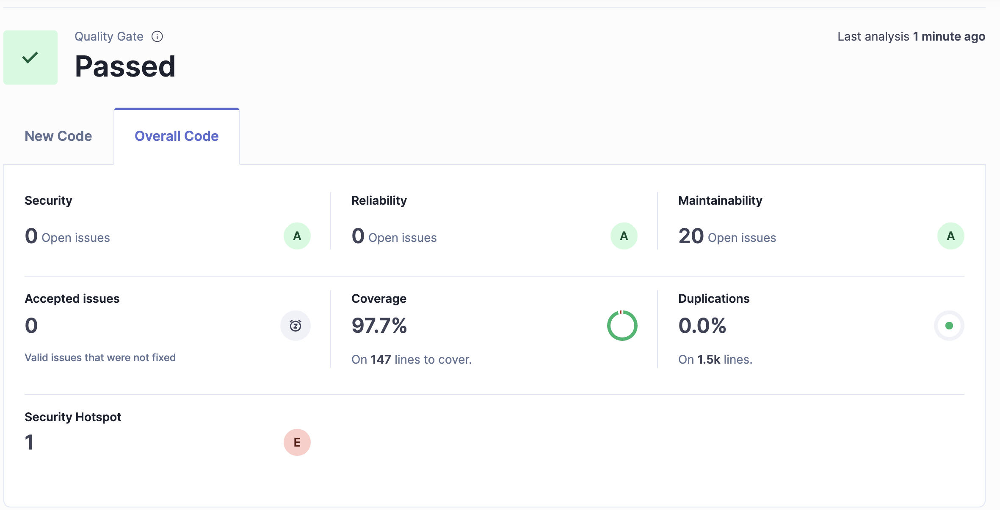

# Card Service

The Card Service is a microservice built using Spring Boot, Maven, MySQL. It provides APIs for card management to meet the challenge proposed for Java Developer hiring process. The API is documented using OpenAPI.

---

## **Technologies Used**

- **Java**: Programming language.
- **Spring Boot**: Framework for building the microservice.
- **Maven**: Dependency management and build tool.
- **MySQL**: Database for development.
- **Flyway**: Database Migrations.
- **OpenAPI**: API documentation and testing interface.

---

## **Quality Gate**



---

## **Getting Started**

### **Prerequisites**

Ensure you have the following installed:

- **Java 21 or higher**
- **[Maven](https://maven.apache.org/download.cgi)**
- **[Docker](https://www.docker.com/products/docker-desktop/)**
- **Docker Compose**


### **Cloning the Repository**

```bash
# Clone the repository
git clone https://github.com/jmauriciojr/card_public
cd card
```

---

### **Build and Run the Application**

1. **Download docker images:**
   ```
   ./docker-compose.sh
   ```

2. **Build docker:**
   ```
   docker build -t hyperativa_card .
   ```
   
3. **Run migration:**
   ```
	mvn clean flyway:migrate -Dflyway.configFiles=flywayConfig.conf
   ```

4. **Run docker:**
   ```
	docker run -p 8080:8080 --name hyperativa_card --net networkmysql -e MYSQL_HOST='host.docker.internal' -e MYSQL_PORT=3306 -e MYSQL_DB=db_card -e MYSQL_USER=root -e mysql_password=mysqlPW hyperativa_card
   ```

The application will start at `http://localhost:8080`.

---

### **API Documentation**

The API is documented using OpenAPI and can be accessed via the Swagger UI:

- Open your browser and navigate to:  [http://localhost:8080/v1/api/swagger-ui/index.html](http://localhost:8080/v1/api/swagger-ui/index.html)

Here, you can view and test all the available endpoints.

---

### **Test with Postman**


- **Install [Postam](https://www.postman.com/downloads/)**
- **Import Postman [Collection](./docs/Card.postman_collection.json)**


1. **login:**
   ```
   get accessToken attribute on response.
   ```

2. **Update token variable:**
   ```
   on Card collection properties.
   ```


---

## **Contact**

For any inquiries or issues, contact the maintainer:
- **Name**: Maurício Rodrigues
- **Email**: [jmauriciojr@gmail.com](mailto:jmauriciojr@gmail.com)

